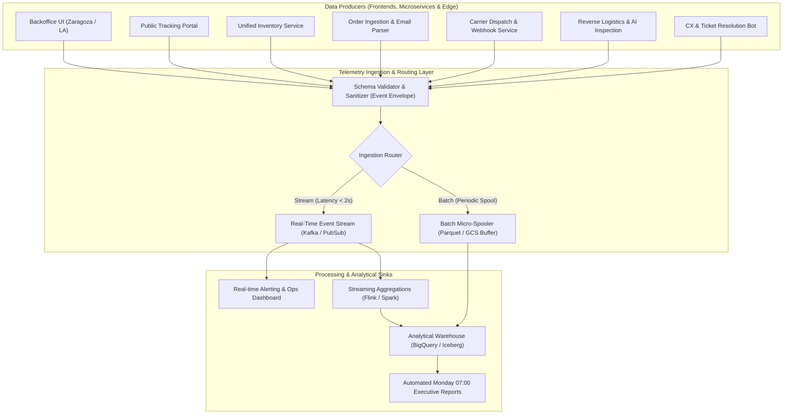
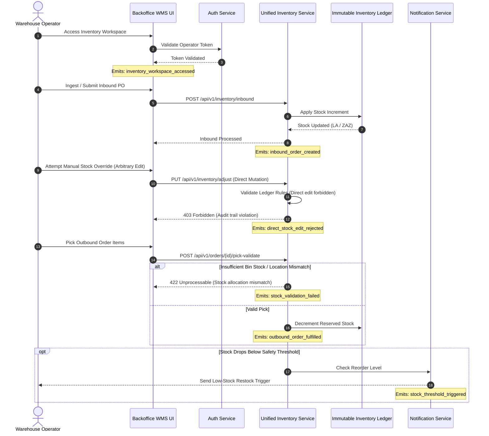
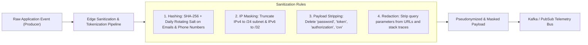
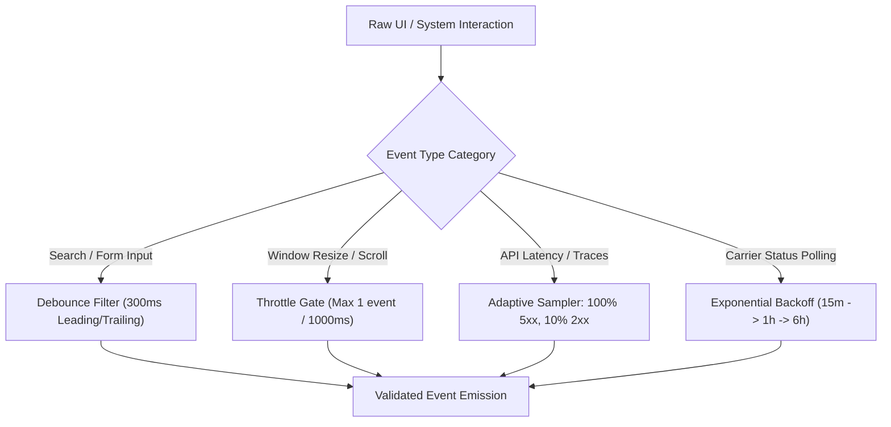

# TrackFlow Telemetry & Observability Master Plan

**Document Version:** `1.0.0`  
**Status:** `Approved / Active`  
**Target Environments:** `Global Monorepo (US - Los Angeles & ES - Zaragoza)`  
**Authors:** `TrackFlow Tech Engineering Team`  
**Related Files:**  
- Schema Definitions: [`docs/telemetry/event-schemas.json`](file:///j:/GitHub/mr-stegmann-ai-engineering-company-project-monorepo/docs/telemetry/event-schemas.json)  
- Company Context: [`CONTEXT.md`](file:///j:/GitHub/mr-stegmann-ai-engineering-company-project-monorepo/CONTEXT.md)

---

## 1. Executive Summary & Telemetry Architecture

### 1.1 Business & Operational Context
TrackFlow operates cross-border third-party logistics (3PL) and fulfillment operations across two primary hubs: **Los Angeles (United States)** and **Zaragoza (Spain)**. Serving mid-to-high volume e-commerce brands (B2B clients) and their end recipients (B2C consumers), TrackFlow coordinates:
- 2 fulfillment hubs (~70 warehouse operators across disparate WMS/spreadsheet setups).
- 8 regional and international carriers (UPS, FedEx, DHL US/ES, MRW, SEUR, and local freight couriers).
- Reverse logistics flows representing 18%–25% of total shipment volume.
- Customer support handling B2B brand SLAs and B2C package tracking inquiries.
- Cross-regional technical infrastructure transitioning from legacy point-to-point scripts to an event-driven unified platform.

This Telemetry Plan establishes an exhaustive, end-to-end data instrumentation blueprint. It guarantees real-time operational observability, cross-warehouse inventory consistency, automated executive reporting, carrier performance auditing, and strict compliance with EU GDPR and California CCPA privacy regulations.



### 1.2 Core Telemetry Principles
1. **Unified Taxonomy (`entity_action`):** Every event identifier strictly follows the `noun_verb` past-tense pattern (e.g., `inbound_order_created`, `stock_threshold_triggered`, `session_expired`).
2. **Standardized Event Envelope:** Every emitted payload is wrapped in a mandatory metadata envelope guaranteeing distributed trace correlation (`requestId`), temporal ordering (`timestamp`), session tracking (`sessionId`), and schema versioning (`schemaVersion`).
3. **Strict Property Allowlists:** No unvetted or arbitrary attributes are admitted. Payload schemas are strictly bounded (`additionalProperties: false`) to prevent accidental schema drift and PII leakage.
4. **Privacy by Design:** Zero raw credentials, passwords, unmasked IP addresses, or unencrypted customer PII (names, raw emails, credit card data) enter the telemetry bus. Pseudonymization (SHA-256 with rotating salt) is enforced at the producer boundary.
5. **Business-Driven Ingestion Strategy:** The choice between **Stream** (real-time pub/sub) and **Batch** (micro-batched Parquet ingestion) is dictated purely by the operational urgency of the downstream business decisions, not developer convenience.

---

## 2. Phase 1 — Exhaustive Catalogue of Data Opportunities

### 2.1 Context Mandatory Metrics Mapping
As established in `CONTEXT.md`, TrackFlow mandates baseline observability across all seven operational and administrative departments:

| Department | Business Owner | Mandatory Metrics / Capabilities Identified in CONTEXT.md | Baseline Telemetry Priority |
| :--- | :--- | :--- | :--- |
| **Warehouse Operations** | Ana Whitfield | Real-time cross-hub stock levels (LA & Zaragoza), automated email order parsing success/failure, picking fulfillment discrepancies, low-stock threshold triggers. | Critical / Real-Time |
| **Last Mile & Carriers** | Carlos Vega | Carrier recommendation choices, multi-carrier tracking state transitions, on-time delivery (OTD) rate, incident frequency by route, shipping cost per kg. | Critical / Hybrid |
| **Reverse Logistics** | Sofía Ramos | Return rate (18%–25% volume), automated return approval rate, AI inspection condition classification accuracy, SKU-level return reasons, turnaround time. | High / Hybrid |
| **Customer Experience** | Valentina Cruz | Inquiry automation/deflection rate (target 80%), customer sentiment score / frustration detection, first-contact resolution (FCR), KB search misses. | High / Stream |
| **Commercial & Accounts** | Miguel Torres | Client account health score, contract renewal churn risk (90-day & 30-day thresholds), automated PDF monthly report delivery status. | Medium / Batch |
| **Technology & Core** | Andrés Kim | Cross-border API latencies (LA ↔ Zaragoza), endpoint HTTP 5xx error rates, unhandled frontend exceptions, automated health check results. | Critical / Stream |
| **Executive Direction** | Daniel Espinoza / Thomas Harry | Global executive KPIs (shipment volume, global OTD, total operating cost per package, return percentages, CSAT), Monday 07:00 automated executive report status. | High / Batch Aggregations |

---

### 2.2 End-to-End Inventory & Order Management Flow Instrumentation
Below is the trace of an inventory transaction flow—from operator authentication and receipt of inbound stock to outbound order fulfillment and direct stock modification rejections.



#### Core Instrumentation Points in Inventory Flow:
1. **`inventory_workspace_accessed`**: Captured upon warehouse operator entry into inventory views.
2. **`inbound_order_created`**: Captured when an inbound supplier manifest or purchase order is ingested and parsed.
3. **`direct_stock_edit_rejected`**: Captured when an operator attempts an ad-hoc un-audited direct stock change (rejected by system policy).
4. **`stock_validation_failed`**: Captured when a pick/pack allocation fails due to bin discrepancy or physical stock shortage.
5. **`stock_threshold_triggered`**: Captured when SKU available inventory drops below the calculated reorder safety threshold.
6. **`outbound_order_fulfilled`**: Captured when outbound pick/pack is validated and ready for carrier handoff.

---

### 2.3 Comprehensive Data Opportunities Catalogue
The following catalogue encompasses all required operational, technical, and business events across TrackFlow.

```
Hypothesis-Decision Formula:
"We capture [event_type] because we need to know [hypothesis], which allows us to make the decision [decision]."
```

#### Catalogue Matrix

| Event Type | Category | Classification | Hypothesis & Decision Statement |
| :--- | :--- | :--- | :--- |
| `inbound_order_created` | Inventory & WMS | **Mandatory (CONTEXT.md)** | **We capture** `inbound_order_created` **because we need to know** the exact volume, origin warehouse, and SKU count entering stock, **which allows us to make the decision** to allocate dock workers, rebalance cross-border stock between LA and Zaragoza, and update real-time client availability. |
| `stock_threshold_triggered` | Inventory & WMS | **Mandatory (CONTEXT.md)** | **We capture** `stock_threshold_triggered` **because we need to know** when SKU stock drops below safe operational buffer thresholds, **which allows us to make the decision** to dispatch automatic replenishment notices to B2B clients and generate supplier procurement orders. |
| `direct_stock_edit_rejected` | Inventory & Security | **Mandatory (CONTEXT.md)** | **We capture** `direct_stock_edit_rejected` **because we need to know** if operators are attempting to bypass audited WMS ledger workflows to adjust stock manually, **which allows us to make the decision** to lock compromised operator permissions and trigger supervisor training or physical inventory audits. |
| `stock_validation_failed` | Inventory & WMS | **Mandatory (CONTEXT.md)** | **We capture** `stock_validation_failed` **because we need to know** the frequency and location of picking/packing discrepancies where physical items don't match digital ledger state, **which allows us to make the decision** to halt erroneous shipment lines, flag phantom stock, and trigger cycle counts on specific warehouse aisles. |
| `outbound_order_fulfilled` | Inventory & WMS | **Mandatory (CONTEXT.md)** | **We capture** `outbound_order_fulfilled` **because we need to know** fulfillment cycle time from pick-list generation to carrier staging, **which allows us to make the decision** to optimize warehouse routing layouts and meet client SLA cut-off commitments. |
| `carrier_recommendation_selected` | Carrier & Last Mile | **Mandatory (CONTEXT.md)** | **We capture** `carrier_recommendation_selected` **because we need to know** whether dispatchers accept or override the optimal carrier engine suggestions across UPS, FedEx, DHL, MRW, and SEUR, **which allows us to make the decision** to refine recommendation cost/speed weighting algorithms and enforce shipping contract compliance. |
| `shipment_tracking_updated` | Carrier & Last Mile | **Mandatory (CONTEXT.md)** | **We capture** `shipment_tracking_updated` **because we need to know** the normalized real-time transit state across 8 carrier APIs, **which allows us to make the decision** to proactively flag stranded shipments, notify end consumers of delays, and auto-populate the public tracking portal. |
| `shipment_incident_recorded` | Carrier & Last Mile | **Mandatory (CONTEXT.md)** | **We capture** `shipment_incident_recorded` **because we need to know** specific route-level lost, damaged, or failed delivery events per carrier, **which allows us to make the decision** to enforce carrier penalty clauses, blacklist unreliable shipping lanes, and initiate customer claim reimbursements. |
| `return_request_evaluated` | Reverse Logistics | **Mandatory (CONTEXT.md)** | **We capture** `return_request_evaluated` **because we need to know** what percentage of returns qualify for automated rule-based approval vs manual triage, **which allows us to make the decision** to streamline merchant return policies, lower human triage labor, and accelerate return labels. |
| `return_item_inspected` | Reverse Logistics | **Mandatory (CONTEXT.md)** | **We capture** `return_item_inspected` **because we need to know** AI visual classification grades (restock, refurbish, scrap) compared to operator confirmation, **which allows us to make the decision** to calibrate AI computer vision models, issue customer refunds instantly, or route scrap products for salvage. |
| `cx_inquiry_resolved` | Customer Experience | **Mandatory (CONTEXT.md)** | **We capture** `cx_inquiry_resolved` **because we need to know** whether tickets are resolved autonomously by the AI agent or escalated to human staff, **which allows us to make the decision** to expand knowledge base articles and meet the 80% automated resolution target. |
| `client_health_score_calculated`| Commercial & Accounts| **Mandatory (CONTEXT.md)** | **We capture** `client_health_score_calculated` **because we need to know** B2B client churn risk scores based on shipment volume shifts and SLA adherence, **which allows us to make the decision** to deploy account managers for proactive retention interventions at 90 and 30 days before contract expiry. |
| `executive_kpi_snapshot_generated`| Executive & Management | **Mandatory (CONTEXT.md)** | **We capture** `executive_kpi_snapshot_generated` **because we need to know** consolidated weekly operational performance (OTD, volume, cost/kg, margins) across both US and Spain, **which allows us to make the decision** to publish Daniel Espinoza's automated Monday 07:00 executive report and adjust capital allocation. |
| `api_latency_recorded` | Performance & Tech | **Mandatory (CONTEXT.md)** | **We capture** `api_latency_recorded` **because we need to know** p95 and p99 latency across cross-regional microservices (Los Angeles ↔ Zaragoza), **which allows us to make the decision** to deploy caching layers, provision read-replicas, or optimize database queries before operations degrade. |
| `frontend_error_captured` | Error & Tech | **Identified Opportunity (Proposed)** | **We capture** `frontend_error_captured` **because we need to know** uncaught client-side JavaScript crashes and component exceptions in warehouse and backoffice dashboards, **which allows us to make the decision** to roll back unstable UI releases and fix runtime defects before warehouse operator workflows stall. |
| `email_order_parse_failed` | Ingestion & Tech | **Identified Opportunity (Proposed)** | **We capture** `email_order_parse_failed` **because we need to know** when unstandardized client email order formats fail automated LLM/regex extraction, **which allows us to make the decision** to update parsing schemas or alert account managers to standardize client email templates. |
| `user_login_attempted` | Authentication | **Identified Opportunity (Proposed)** | **We capture** `user_login_attempted` **because we need to know** authentication request velocity, geographic anomalies, and client user-agents, **which allows us to make the decision** to block brute-force credential stuffing attacks and enforce adaptive MFA challenges. |
| `session_expired` | Authentication | **Identified Opportunity (Proposed)** | **We capture** `session_expired` **because we need to know** whether operators are being abruptly logged out during active warehouse picking sessions, **which allows us to make the decision** to adjust token lifespan and implement smooth background token refreshes for handheld RF scanners. |
| `carrier_webhook_failed` | Carrier & Ingestion | **Identified Opportunity (Proposed)** | **We capture** `carrier_webhook_failed` **because we need to know** when third-party carrier status webhooks fail signature validation or schema parsing, **which allows us to make the decision** to route payloads to dead-letter queues (DLQ) and trigger fallback carrier polling. |
| `cx_sentiment_flagged` | Customer Experience | **Identified Opportunity (Proposed)** | **We capture** `cx_sentiment_flagged` **because we need to know** when customer interactions cross severe frustration sentiment thresholds, **which allows us to make the decision** to immediately prioritize supervisor escalation before negative brand reviews occur. |
| `section_navigation_tracked` | Navigation & UX | **Identified Opportunity (Proposed)** | **We capture** `section_navigation_tracked` **because we need to know** which backoffice modules and analytical reports are most frequently utilized by operators and managers, **which allows us to make the decision** to simplify UI navigation hierarchies and deprecate unused views. |
| `flow_abandonment_detected` | Navigation & UX | **Identified Opportunity (Proposed)** | **We capture** `flow_abandonment_detected` **because we need to know** where operators drop off midway through complex multi-step workflows (such as custom carrier manifests or manual return overrides), **which allows us to make the decision** to streamline UI form ergonomics and provide inline validation guidance. |

---

## 3. Phase 2 — Event Envelope & Schema Design

### 3.1 Universal Event Envelope Standard
Every single telemetry event emitted in TrackFlow MUST adhere to the following top-level envelope schema. Unenveloped or loosely structured payloads are rejected at the ingestion gateway.

```json
{
  "$schema": "http://json-schema.org/draft-07/schema#",
  "title": "TrackFlowEventEnvelope",
  "type": "object",
  "required": [
    "eventId",
    "timestamp",
    "sessionId",
    "userId",
    "event_type",
    "schemaVersion",
    "requestId",
    "properties"
  ],
  "additionalProperties": false,
  "properties": {
    "eventId": {
      "type": "string",
      "format": "uuid",
      "description": "Globally unique UUIDv4 identifying this specific event instance."
    },
    "timestamp": {
      "type": "string",
      "format": "date-time",
      "description": "ISO 8601 UTC timestamp recording when the event occurred (e.g., 2026-09-29T14:32:00.123Z)."
    },
    "sessionId": {
      "type": "string",
      "description": "Unique session identifier grouping user or agent activity across contiguous interactions."
    },
    "userId": {
      "type": ["string", "null"],
      "description": "Pseudonymized identifier of the authenticated operator, client, or system actor (null for unauthenticated events)."
    },
    "event_type": {
      "type": "string",
      "pattern": "^[a-z0-9]+(_[a-z0-9]+)+$",
      "description": "Event name conforming strictly to 'entity_action' taxonomy in snake_case (e.g., inbound_order_created)."
    },
    "schemaVersion": {
      "type": "string",
      "pattern": "^[0-9]+\\.[0-9]+\\.[0-9]+$",
      "description": "Semantic version of the event schema definition (e.g., 1.0.0)."
    },
    "requestId": {
      "type": "string",
      "description": "Distributed tracing correlation identifier (W3C TraceContext or UUID) bridging frontend, backend, and database spans."
    },
    "properties": {
      "type": "object",
      "description": "Event-specific domain payload validated against the strict property allowlist for the given event_type."
    }
  }
}
```

---

### 3.2 Detailed Event Schemas & Property Allowlists

Below are the detailed specifications for the mandatory metrics and key opportunity events across all core operational categories. The complete, machine-validatable JSON Schema is exported to [`docs/telemetry/event-schemas.json`](file:///j:/GitHub/mr-stegmann-ai-engineering-company-project-monorepo/docs/telemetry/event-schemas.json).

```
Schema Security Rule:
All properties schemas enforce `additionalProperties: false`.
Only explicitly allowlisted properties are accepted.
```

---

#### 3.2.1 Category: Inventory & Warehouse Operations

##### Event: `inbound_order_created`
- **Taxonomy:** `inbound_order_created`
- **Description:** Emitted when a new inbound stock manifest or client purchase order is created and registered into the unified inventory catalog.
- **Data Classification & PII:** Internal operational data. No direct customer PII. Supplier email is pseudonymized.
- **Property Allowlist:**
  - `inboundOrderId` (`string`, required): Unique inbound shipment identifier.
  - `clientId` (`string`, required): Identifier of the merchant/brand owning the inventory.
  - `warehouseCode` (`string`, required, enum: `["US-LAX-01", "ES-ZAZ-01"]`): Destination warehouse hub.
  - `totalSkus` (`integer`, required, min: 1): Number of distinct SKU lines in the manifest.
  - `totalUnits` (`integer`, required, min: 1): Total physical units expected.
  - `sourceChannel` (`string`, required, enum: `["EMAIL_AUTO_PARSED", "MANUAL_ENTRY", "EDI_IMPORT", "API_SYNC"]`): Channel through which order was created.
  - `supplierIdHash` (`string`, optional): SHA-256 pseudonymized hash of the external supplier ID.

##### Event: `stock_threshold_triggered`
- **Taxonomy:** `stock_threshold_triggered`
- **Description:** Emitted when available stock for an SKU drops below the configured reorder buffer.
- **Data Classification & PII:** Strictly operational telemetry. Zero PII.
- **Property Allowlist:**
  - `sku` (`string`, required): Stock Keeping Unit string.
  - `clientId` (`string`, required): B2B client owner.
  - `warehouseCode` (`string`, required, enum: `["US-LAX-01", "ES-ZAZ-01"]`): Hub location.
  - `currentStock` (`integer`, required, min: 0): Real-time on-hand available inventory count.
  - `thresholdLimit` (`integer`, required, min: 1): Configured minimum stock trigger level.
  - `triggerReason` (`string`, required, enum: `["OUTBOUND_FULFILLMENT", "CYCLE_COUNT_ADJUSTMENT", "DAMAGED_DISPOSAL"]`): Cause of stock decrease.
  - `automatedRestockNoticeSent` (`boolean`, required): Whether an automated email/webhook alert was dispatched to the client.

##### Event: `direct_stock_edit_rejected`
- **Taxonomy:** `direct_stock_edit_rejected`
- **Description:** Emitted when a user/operator attempts to directly mutate stock levels via UI or raw API without an audited adjustment manifest.
- **Data Classification & PII:** Security and audit event. Captures operator ID (pseudonymized).
- **Property Allowlist:**
  - `operatorIdHash` (`string`, required): SHA-256 hash of operator identifier.
  - `sku` (`string`, required): Targeted SKU.
  - `warehouseCode` (`string`, required, enum: `["US-LAX-01", "ES-ZAZ-01"]`): Warehouse hub.
  - `attemptedQuantityDelta` (`integer`, required): Quantity attempted to be added/subtracted directly.
  - `rejectionReason` (`string`, required): System violation reason (e.g., `UNAUDITED_MUTATION_FORBIDDEN`).
  - `uiComponentId` (`string`, required): Interface element where action originated.

##### Event: `stock_validation_failed`
- **Taxonomy:** `stock_validation_failed`
- **Description:** Emitted when an outbound pick or transfer allocation fails due to digital/physical stock inventory mismatch.
- **Data Classification & PII:** Operational data. Zero PII.
- **Property Allowlist:**
  - `orderId` (`string`, required): Outbound order reference.
  - `sku` (`string`, required): SKU failing validation.
  - `warehouseCode` (`string`, required, enum: `["US-LAX-01", "ES-ZAZ-01"]`): Hub location.
  - `binLocation` (`string`, required): Physical rack/bin aisle identifier.
  - `expectedUnits` (`integer`, required): Units recorded in digital inventory.
  - `foundUnits` (`integer`, required): Units physically confirmed present by operator.
  - `discrepancyType` (`string`, required, enum: `["SHORTAGE", "LOCATION_MISMATCH", "DAMAGED_ITEM", "BARCODE_MISREAD"]`).

##### Event: `outbound_order_fulfilled`
- **Taxonomy:** `outbound_order_fulfilled`
- **Description:** Emitted when an outbound order completes picking, packing, and barcode validation, ready for carrier dispatch.
- **Data Classification & PII:** Commercial data. Recipient zip code retained for route analytics; all recipient PII stripped.
- **Property Allowlist:**
  - `orderId` (`string`, required): Outbound fulfillment order ID.
  - `clientId` (`string`, required): Merchant owner ID.
  - `warehouseCode` (`string`, required, enum: `["US-LAX-01", "ES-ZAZ-01"]`): Hub fulfilling order.
  - `packageWeightKg` (`number`, required, min: 0.01): Total physical package weight in kilograms.
  - `itemCount` (`integer`, required, min: 1): Quantity of units fulfilled.
  - `pickDurationSeconds` (`integer`, required, min: 0): Time spent from pick list dispatch to pack finish.
  - `destinationCountry` (`string`, required, enum: `["US", "ES", "EU", "INTL"]`): Country destination zone.
  - `destinationPostalCodeMasked` (`string`, required): First 3 digits of postal code (e.g., `902xx` or `500xx`).

---

#### 3.2.2 Category: Carrier & Last-Mile Logistics

##### Event: `carrier_recommendation_selected`
- **Taxonomy:** `carrier_recommendation_selected`
- **Description:** Emitted when the dispatch engine recommends a carrier and the operator confirms or overrides the selection.
- **Data Classification & PII:** Operational logistics telemetry. Zero PII.
- **Property Allowlist:**
  - `orderId` (`string`, required): Fulfillment order ID.
  - `recommendedCarrier` (`string`, required, enum: `["UPS", "FEDEX", "DHL_US", "DHL_ES", "MRW", "SEUR", "LOCAL_COURIER"]`).
  - `selectedCarrier` (`string`, required, enum: `["UPS", "FEDEX", "DHL_US", "DHL_ES", "MRW", "SEUR", "LOCAL_COURIER"]`).
  - `isOverride` (`boolean`, required): True if operator changed recommendation.
  - `overrideReason` (`string`, optional): Required if `isOverride` is true (e.g., `CARRIER_STRIKE`, `SPECIAL_HANDLING`).
  - `estimatedCostEur` (`number`, required, min: 0.0): Estimated transit cost in EUR.
  - `estimatedTransitHours` (`integer`, required, min: 1): SLA promised transit window.

##### Event: `shipment_tracking_updated`
- **Taxonomy:** `shipment_tracking_updated`
- **Description:** Emitted when an ingested carrier tracking webhook or polled API status indicates a shipment milestone transition.
- **Data Classification & PII:** Public and operational tracking data. Sanitized location names. Zero customer names/addresses.
- **Property Allowlist:**
  - `trackingNumberHash` (`string`, required): SHA-256 hash of carrier tracking number.
  - `carrierCode` (`string`, required, enum: `["UPS", "FEDEX", "DHL", "MRW", "SEUR"]`).
  - `normalizedStatus` (`string`, required, enum: `["LABEL_CREATED", "PICKED_UP", "IN_TRANSIT", "OUT_FOR_DELIVERY", "DELIVERED", "EXCEPTION", "FAILED_ATTEMPT"]`).
  - `rawCarrierStatus` (`string`, required): Exact string provided by carrier API.
  - `locationCity` (`string`, optional): Transit checkpoint city.
  - `locationCountry` (`string`, required): 2-letter ISO country code.
  - `isDeliveredOnTime` (`boolean`, optional): Calculated against original SLA target.

##### Event: `shipment_incident_recorded`
- **Taxonomy:** `shipment_incident_recorded`
- **Description:** Emitted when a carrier reports a lost package, route failure, damaged goods, or address rejection.
- **Data Classification & PII:** Operational & SLA auditing. No customer PII.
- **Property Allowlist:**
  - `trackingNumberHash` (`string`, required): Hashed tracking ID.
  - `orderId` (`string`, required): TrackFlow internal order reference.
  - `carrierCode` (`string`, required, enum: `["UPS", "FEDEX", "DHL", "MRW", "SEUR"]`).
  - `incidentType` (`string`, required, enum: `["LOST_IN_TRANSIT", "DAMAGED_GOODS", "ADDRESS_INCORRECT", "REFUSED_BY_RECIPIENT", "CUSTOMS_HOLD"]`).
  - `incidentSeverity` (`string`, required, enum: `["LOW", "MEDIUM", "HIGH", "CRITICAL"]`).
  - `estimatedClaimValueEur` (`number`, optional, min: 0.0): Declared item value for insurance claims.

---

#### 3.2.3 Category: Reverse Logistics & AI Inspections

##### Event: `return_request_evaluated`
- **Taxonomy:** `return_request_evaluated`
- **Description:** Emitted when an incoming customer return request is evaluated by the automated rules engine.
- **Data Classification & PII:** Reverse logistics data. Brand client ID and return authorization ID. Consumer ID pseudonymized.
- **Property Allowlist:**
  - `returnId` (`string`, required): Return authorization number (RMA).
  - `clientId` (`string`, required): Merchant owner ID.
  - `sku` (`string`, required): Returned SKU.
  - `evaluationOutcome` (`string`, required, enum: `["AUTO_APPROVED", "AUTO_REJECTED", "ESCALATED_MANUAL_REVIEW"]`).
  - `ruleTriggered` (`string`, required): Specific rule evaluated (e.g., `WITHIN_30_DAYS_POLICY`, `NON_RETURNABLE_CATEGORY`).
  - `declaredReason` (`string`, required, enum: `["DEFECTIVE", "WRONG_SIZE", "UNWANTED", "NOT_AS_DESCRIBED", "LATE_DELIVERY"]`).

##### Event: `return_item_inspected`
- **Taxonomy:** `return_item_inspected`
- **Description:** Emitted when a returned physical item is photographed at the warehouse and classified by the AI inspection agent.
- **Data Classification & PII:** Operational & AI telemetry. Stores AI model version and classification confidence.
- **Property Allowlist:**
  - `returnId` (`string`, required): RMA number.
  - `warehouseCode` (`string`, required, enum: `["US-LAX-01", "ES-ZAZ-01"]`).
  - `sku` (`string`, required): SKU inspected.
  - `aiConditionClassification` (`string`, required, enum: `["A_GRADE_NEW", "B_GRADE_REFURBISH", "C_GRADE_DAMAGED", "SCRAP_DISPOSAL"]`).
  - `aiConfidenceScore` (`number`, required, min: 0.0, max: 1.0): Model prediction confidence.
  - `aiModelVersion` (`string`, required): Deployed model tag (e.g., `cv-inspector-v2.1.0`).
  - `operatorOverrodeAi` (`boolean`, required): True if warehouse inspector manually changed grade.
  - `finalGrade` (`string`, required, enum: `["A_GRADE_NEW", "B_GRADE_REFURBISH", "C_GRADE_DAMAGED", "SCRAP_DISPOSAL"]`).

---

#### 3.2.4 Category: Customer Experience (CX) & Support

##### Event: `cx_inquiry_resolved`
- **Taxonomy:** `cx_inquiry_resolved`
- **Description:** Emitted when a customer inquiry (B2B client or B2C recipient) is closed and marked resolved.
- **Data Classification & PII:** Support telemetry. Customer email/phone hashed. No raw conversation text.
- **Property Allowlist:**
  - `ticketId` (`string`, required): Support ticket identifier.
  - `inquiryChannel` (`string`, required, enum: `["EMAIL", "WHATSAPP", "PHONE", "PORTAL_CHAT"]`).
  - `inquiryCategory` (`string`, required, enum: `["WHERE_IS_MY_ORDER", "RETURN_STATUS", "INVENTORY_QUERY", "BILLING", "CARRIER_CLAIM"]`).
  - `resolvedBy` (`string`, required, enum: `["AI_AGENT_AUTONOMOUS", "HUMAN_AGENT_SOLO", "HYBRID_AI_ASSISTED"]`).
  - `handlingTimeSeconds` (`integer`, required, min: 1): Duration from initial message to resolution.
  - `firstContactResolution` (`boolean`, required): True if solved without follow-up customer inquiries.
  - `customerType` (`string`, required, enum: `["B2B_BRAND", "B2C_CONSUMER"]`).

##### Event: `cx_sentiment_flagged`
- **Taxonomy:** `cx_sentiment_flagged`
- **Description:** Emitted when NLP sentiment analysis detects negative sentiment or escalation signals in user messages.
- **Data Classification & PII:** NLP metrics. Raw message text omitted; sentiment polarity and keyword categories stored.
- **Property Allowlist:**
  - `ticketId` (`string`, required): Ticket reference.
  - `sentimentScore` (`number`, required, min: -1.0, max: 1.0): Quantified polarity (-1.0 highly negative, +1.0 positive).
  - `escalationCategory` (`string`, required, enum: `["DELIVERY_DELAY_FRUSTRATION", "DAMAGED_GOODS_ANGER", "REPEATED_CONTACT_FATIGUE", "THREATENED_LEGAL_CHURN"]`).
  - `autoEscalatedToSupervisor` (`boolean`, required): True if ticket was automatically promoted to urgent queue.

---

#### 3.2.5 Category: Commercial & Executive Governance

##### Event: `client_health_score_calculated`
- **Taxonomy:** `client_health_score_calculated`
- **Description:** Emitted during periodic batch evaluation of B2B client satisfaction, volume trajectory, and renewal risk.
- **Data Classification & PII:** Internal commercial intelligence. Zero PII.
- **Property Allowlist:**
  - `clientId` (`string`, required): Merchant identifier.
  - `healthScore` (`integer`, required, min: 0, max: 100): Calculated account health (0 critical, 100 excellent).
  - `churnRiskTier` (`string`, required, enum: `["LOW", "MEDIUM", "HIGH", "CRITICAL"]`).
  - `daysToContractRenewal` (`integer`, required): Days remaining on annual B2B contract.
  - `monthlyShipmentVolumeVariance` (`number`, required): Percentage change vs preceding 3-month average.
  - `slaAdherenceRate` (`number`, required, min: 0.0, max: 1.0): 30-day fulfillment SLA compliance percentage.

##### Event: `executive_kpi_snapshot_generated`
- **Taxonomy:** `executive_kpi_snapshot_generated`
- **Description:** Emitted upon compilation of consolidated cross-border metrics for the Monday 07:00 CEO dashboard.
- **Data Classification & PII:** High-level executive aggregates. Zero PII.
- **Property Allowlist:**
  - `reportingPeriodStart` (`string`, required, format: `date-time`): Start date of weekly snapshot.
  - `reportingPeriodEnd` (`string`, required, format: `date-time`): End date of weekly snapshot.
  - `totalShipmentsFulfilledUs` (`integer`, required, min: 0): Weekly US volume.
  - `totalShipmentsFulfilledEs` (`integer`, required, min: 0): Weekly Spain volume.
  - `onTimeDeliveryRateGlobal` (`number`, required, min: 0.0, max: 1.0): Combined OTD percentage.
  - `globalReturnRatePercentage` (`number`, required, min: 0.0, max: 100.0): Return volume as percentage of shipments.
  - `avgCostPerKgEur` (`number`, required, min: 0.0): Average blended logistics cost.
  - `reportGenerationStatus` (`string`, required, enum: `["SUCCESS", "PARTIAL_DATA", "FAILED"]`).

---

#### 3.2.6 Category: Technical Observability, Security & Performance

##### Event: `api_latency_recorded`
- **Taxonomy:** `api_latency_recorded`
- **Description:** Emitted by API gateways and microservice interceptors to track endpoint latency and status.
- **Data Classification & PII:** Technical telemetry. Strips all query parameters containing tokens or identifiers.
- **Property Allowlist:**
  - `httpMethod` (`string`, required, enum: `["GET", "POST", "PUT", "PATCH", "DELETE"]`).
  - `routeTemplate` (`string`, required): Parameterized path (e.g., `/api/v1/inventory/{sku}/stock`).
  - `statusCode` (`integer`, required, min: 100, max: 599): HTTP status code.
  - `durationMs` (`number`, required, min: 0.0): Server execution latency in milliseconds.
  - `serverRegion` (`string`, required, enum: `["us-west-2-lax", "eu-west-3-zaz"]`).
  - `targetService` (`string`, required, enum: `["inventory-service", "carrier-service", "returns-service", "cx-gateway"]`).

##### Event: `frontend_error_captured`
- **Taxonomy:** `frontend_error_captured`
- **Description:** Emitted by backoffice and client tracking frontends upon uncaught JavaScript runtime exceptions.
- **Data Classification & PII:** Technical error telemetry. Stack traces are sanitized to strip cookies, authorization tokens, or URL query PII.
- **Property Allowlist:**
  - `errorName` (`string`, required): Exception type (e.g., `TypeError`, `NetworkError`).
  - `sanitizedMessage` (`string`, required): Error message with IDs and emails replaced with placeholders.
  - `componentStack` (`string`, optional): React/DOM component hierarchy.
  - `pageUrl` (`string`, required): Stripped page path (no sensitive query params).
  - `browserUserAgent` (`string`, required): Browser environment identifier.
  - `releaseVersion` (`string`, required): Frontend commit SHA or semantic build tag.

##### Event: `user_login_attempted`
- **Taxonomy:** `user_login_attempted`
- **Description:** Emitted on all authentication challenges to monitor credential attacks and session security.
- **Data Classification & PII:** Security event. Raw passwords strictly purged; username/email hashed with SHA-256; IP addresses masked to `/24` CIDR.
- **Property Allowlist:**
  - `accountType` (`string`, required, enum: `["OPERATOR", "WAREHOUSE_ADMIN", "BRAND_CLIENT", "SYSTEM_SERVICE"]`).
  - `usernameHash` (`string`, required): SHA-256 hash of attempted username/email.
  - `attemptStatus` (`string`, required, enum: `["SUCCESS", "INVALID_CREDENTIALS", "LOCKED_OUT", "MFA_REQUIRED", "MFA_FAILED"]`).
  - `clientIpMasked` (`string`, required): Masked IP address (e.g., `192.168.1.0/24` or `2001:db8::/32`).
  - `authMethod` (`string`, required, enum: `["PASSWORD", "SSO_OIDC", "MFA_TOTP", "API_KEY"]`).

##### Event: `session_expired`
- **Taxonomy:** `session_expired`
- **Description:** Emitted when an operator or client session terminates due to TTL expiration or idle timeout.
- **Data Classification & PII:** Authentication telemetry. Zero PII.
- **Property Allowlist:**
  - `sessionDurationMinutes` (`integer`, required, min: 0): Active session duration before expiry.
  - `expirationReason` (`string`, required, enum: `["IDLE_TIMEOUT", "TOKEN_TTL_EXPIRED", "CONCURRENT_LOGIN_INVALIDATION", "ADMIN_REVOKED"]`).
  - `lastActiveRoute` (`string`, required): Route where session expired.
  - `deviceType` (`string`, required, enum: `["DESKTOP_WORKSTATION", "RF_BARCODE_SCANNER", "TABLET", "MOBILE"]`).

##### Event: `section_navigation_tracked`
- **Taxonomy:** `section_navigation_tracked`
- **Description:** Emitted when an authenticated user navigates between distinct backoffice views.
- **Data Classification & PII:** Product usage analytics. Zero PII.
- **Property Allowlist:**
  - `fromRoute` (`string`, required): Origin URL route path.
  - `toRoute` (`string`, required): Destination URL route path.
  - `navigationType` (`string`, required, enum: `["SIDEBAR_CLICK", "BREADCRUMB", "DIRECT_URL", "IN_PAGE_BUTTON"]`).
  - `dwellTimePreviousSectionSeconds` (`integer`, optional, min: 0): Time spent in origin section.

---

### 3.3 Data Privacy, Anonymization & Sanitization Governance

TrackFlow operates simultaneously under **European Union GDPR** (Zaragoza hub) and **California CCPA** (Los Angeles hub). Strict data minimization is enforced:



#### Privacy Enforcement Rules:
1. **Customer Identifiers:** End-consumer names, street addresses, phone numbers, and raw email addresses are **never** admitted to telemetry. Only obfuscated hashes (`userIdHash`, `trackingNumberHash`) and coarse location codes (3-digit postal code masks) are stored.
2. **Credential Sanitization:** Middleware interceptors automatically reject and purge any payload key matching `(?i)(password|token|secret|authorization|bearer|cookie|ssn|credit_card)`.
3. **IP Obfuscation:** Client IP addresses are truncated at the ingress gateway:
   - IPv4: `198.51.100.42` $\rightarrow$ `198.51.100.0/24`
   - IPv6: `2001:0db8:85a3:0000:0000:8a2e:0370:7334` $\rightarrow$ `2001:0db8::/32`
4. **Right to Erasure (GDPR Art. 17):** Because telemetry uses cryptographically salted one-way hashes, events in analytical warehouses contain zero direct personal data, fulfilling GDPR principles of pseudonymization by design.

---

## 4. Phase 3 — Delivery Strategy: Stream vs. Batch

### 4.1 Delivery Classification & Business Justification Matrix

The routing decision between **Stream (Real-Time Ingestion: latency < 2 seconds)** and **Batch (Micro-Batched / Hourly / Daily: latency 15 min – 24 hrs)** is determined strictly by operational urgency and business impact:

```mermaid
quadrantChart
    title Telemetry Ingestion Urgency Matrix
    x-axis Low Operational Urgency --> High Operational Urgency
    y-axis Low Financial / Safety Risk --> High Financial / Safety Risk
    quadrant-1 Stream: Real-Time Alerts & Immediate Action
    quadrant-2 Stream: Mission-Critical Ops & Security
    quadrant-3 Batch: Long-Term Trends & Audits
    quadrant-4 Batch: Business Reporting & Cost Analysis
    "direct_stock_edit_rejected": [0.88, 0.92]
    "stock_threshold_triggered": [0.85, 0.78]
    "shipment_incident_recorded": [0.78, 0.82]
    "user_login_attempted": [0.92, 0.88]
    "api_latency_recorded": [0.82, 0.72]
    "frontend_error_captured": [0.75, 0.65]
    "shipment_tracking_updated": [0.72, 0.58]
    "inbound_order_created": [0.65, 0.60]
    "outbound_order_fulfilled": [0.62, 0.55]
    "return_item_inspected": [0.58, 0.52]
    "cx_sentiment_flagged": [0.80, 0.70]
    "cx_inquiry_resolved": [0.35, 0.38]
    "client_health_score_calculated": [0.25, 0.45]
    "executive_kpi_snapshot_generated": [0.15, 0.50]
    "section_navigation_tracked": [0.20, 0.18]
    "session_expired": [0.30, 0.22]
```

| Event Type | Strategy | Latency Target | Operational & Business Justification |
| :--- | :--- | :--- | :--- |
| `direct_stock_edit_rejected` | **Stream** | $< 1\text{s}$ | **Critical Security/Audit:** Immediate detection required to identify rogue inventory manipulation, unauthorized privilege escalation, or corrupted client scripts before physical theft or ledger corruption occurs. |
| `stock_threshold_triggered` | **Stream** | $< 2\text{s}$ | **Stockout Prevention:** E-commerce clients experience severe revenue loss if orders continue accepting purchases for out-of-stock items. Automated procurement notices must trigger instantly. |
| `shipment_incident_recorded` | **Stream** | $< 5\text{s}$ | **Immediate Carrier Intervention:** Lost or damaged packages on high-value routes require immediate support intervention, carrier claims filing, and instant replacement dispatch before customers escalate. |
| `user_login_attempted` | **Stream** | $< 1\text{s}$ | **Cybersecurity & Brute Force Defense:** Real-time stream processing is required to calculate rolling-window login velocity and trigger automated IP banning and adaptive MFA challenges. |
| `api_latency_recorded` | **Stream** | $< 5\text{s}$ | **SRE SLA & Outage Detection:** Degraded p99 latency between Los Angeles and Zaragoza must trip automated circuit breakers and auto-scaling rules before operations grind to a halt. |
| `cx_sentiment_flagged` | **Stream** | $< 2\text{s}$ | **Customer Churn Prevention:** Severely frustrated B2B brand contacts or high-value consumers must be routed to human supervisors within seconds to prevent public complaints. |
| `shipment_tracking_updated` | **Stream** | $< 10\text{s}$ | **Public Portal State:** End consumers expect immediate tracking progress on delivery day. Stale data drives unnecessary inbound support calls. |
| `inbound_order_created` | **Stream** | $< 5\text{s}$ | **Cross-Warehouse Inventory Visibility:** Instant synchronization ensures inventory arriving at Zaragoza or LA is immediately reservable in the unified catalog. |
| `outbound_order_fulfilled` | **Stream** | $< 5\text{s}$ | **Carrier Manifest Cutoffs:** Outbound fulfillment status must immediately feed carrier dispatch manifests to meet strict daily 18:00 carrier pickup cutoffs. |
| `return_item_inspected` | **Stream** | $< 10\text{s}$ | **Instant Refund Processing:** AI inspection approval triggers automated client refunds and instant restocking of A-grade items into available inventory. |
| `frontend_error_captured` | **Stream** | $< 5\text{s}$ | **Release Health:** Sudden spikes in client-side exceptions post-deployment indicate bad builds and require automated Canary rollback. |
| `cx_inquiry_resolved` | **Batch** | $1\text{ hour}$ | **SLA & Deflection Aggregation:** CX resolution times and deflection statistics are evaluated as hourly and daily aggregates; real-time streaming provides no operational benefit. |
| `client_health_score_calculated` | **Batch** | $24\text{ hours}$ | **Long-Horizon Trend Analysis:** Churn risk, SLA adherence, and shipment volume trends are evaluated over 30-day and 90-day moving windows. |
| `executive_kpi_snapshot_generated` | **Batch** | Weekly (Mon 06:00) | **Executive Cadence:** Daniel Espinoza reviews the consolidated company report once per week on Monday morning at 07:00. Batch computation avoids wasteful continuous processing. |
| `section_navigation_tracked` | **Batch** | $6\text{ hours}$ | **UX Product Optimization:** Backoffice navigation patterns are analyzed asynchronously by product teams for ergonomics and workflow streamlining. |
| `session_expired` | **Batch** | $1\text{ hour}$ | **Session Analytics:** Idle timeout telemetry is analyzed in aggregate to calibrate token expiration lifespans. |

---

### 4.2 Throttle, Debounce & High-Frequency Sampling Strategy

High-frequency telemetry producers must be regulated to prevent network congestion, browser CPU exhaustion, and runaway cloud ingestion costs:



#### Detailed Throttling Rules:
1. **API Performance Sampling (`api_latency_recorded`):**
   - **HTTP 5xx and 4xx Errors:** **100% capture rate** (Zero sampling; every failure is critical).
   - **HTTP 2xx Successes:** **10% deterministic sampling** (based on `hash(requestId) % 10 == 0`) to maintain statistically accurate p50/p95/p99 latency calculations while slashing storage costs by 90%.
2. **Backoffice UI Navigation & Interactions:**
   - **Form Keystroke / Autocomplete:** Debounced at **300ms**; telemetry is emitted only on blur or final selection, never per keystroke.
   - **Viewport / Scrolling Telemetry:** Throttled to a maximum frequency of **1 event per 1,000ms**.
3. **Carrier Polling Backoff (`shipment_tracking_updated`):**
   - For carriers without webhooks requiring polling (e.g. legacy freight):
     - Active delivery day: Poll every **30 minutes**.
     - Long-haul transit: Poll every **3 hours**.
     - Delivered / Final State: **0 polling** (Terminal state reached).

---

## 5. Risks and Exclusions

### 5.1 Discarded Events & Technical Justification

During telemetry planning, several event concepts were evaluated and formally discarded to maintain system performance, data integrity, and strict legal compliance:

| Discarded Event Concept | Proposed Reason | Why Discarded (Technical, Security & Cost Rationale) |
| :--- | :--- | :--- |
| `raw_keystroke_logged` | Track operator typing speed in WMS forms. | **Rejected (Security & Privacy):** Severe risk of capturing passwords, credit card numbers, and personal communications. High network payload overhead with zero actionable business value. |
| `full_dom_snapshot_captured` | Replay frontend operator sessions visually. | **Rejected (Performance & Cost):** Transmitting serialized DOM trees on every click degrades warehouse RF scanner battery and WiFi bandwidth, while generating multi-terabyte unindexed blob storage costs. |
| `raw_carrier_payload_stored` | Store uncompressed 50KB carrier JSON responses. | **Rejected (Storage Bloat):** Redundant payload bloat. The normalized `shipment_tracking_updated` schema extracts all required state indicators; raw XML/JSON is discarded after schema parsing. |
| `realtime_cursor_movement_tracked` | Track mouse coordinates in backoffice. | **Rejected (Noise & Battery):** Massive event volume without clear hypothesis. Warehouse operators primarily use touch screens and physical barcode scanners. |
| `raw_customer_payment_logged` | Track checkout and billing card details. | **Rejected (PCI-DSS Violation):** TrackFlow is a logistics fulfillment partner, not a payment gateway. Payment processing is isolated to Stripe/Adyen merchant integrations; zero raw financial account data enters our pipelines. |

---

### 5.2 Regulatory Compliance & Exclusions (GDPR & CCPA)

1. **No Raw Email or Phone Numbers:** Storing raw customer communication handles in unstructured event logs is strictly prohibited. Hashes with salt are used for correlation across returns and deliveries.
2. **Data Retention Limits:**
   - Raw Stream Data (Kafka / PubSub): **7-day retention**.
   - Detailed Operational Event Tables (BigQuery / Lakehouse): **90-day partitioned retention**.
   - Monthly / Weekly Aggregates: **7-year retention** for business accounting and contract renewal history.
3. **Audit Trails for Rejections:** All rejections (e.g. `direct_stock_edit_rejected`) are immutable and stored in security audit partitions accessible only by compliance officers and CTO Andrés Kim.

---

## 6. Implementation & Verification Roadmap

### 6.1 Developer Integration Checklist
To instrument a new feature or service in the TrackFlow monorepo:
- [ ] Import the standard telemetry SDK from `@trackflow/telemetry-client`.
- [ ] Ensure the emitted event matches an allowlisted schema defined in [`docs/telemetry/event-schemas.json`](file:///j:/GitHub/mr-stegmann-ai-engineering-company-project-monorepo/docs/telemetry/event-schemas.json).
- [ ] Populate the universal Event Envelope fields (`eventId`, `timestamp`, `sessionId`, `userId`, `event_type`, `schemaVersion`, `requestId`, `properties`).
- [ ] Pass the payload through local schema validation middleware in unit/integration test suites.
- [ ] Confirm no unmasked PII or non-allowlisted properties are emitted.
- [ ] Register whether the event targets the **Stream** or **Batch** ingestion pipeline.

---

**End of Plan**  
*TrackFlow Tech — Engineering & Architecture Documentation*
