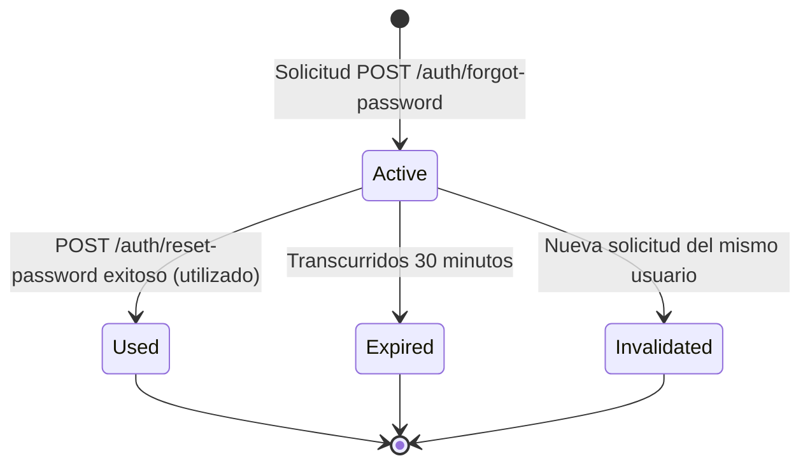

# Data Model & Schema Definitions

## Entities

### User (`User`)
- **`id`**: String (UUID) - Identificador único de usuario.
- **`email`**: String - Correo electrónico de acceso.
- **`passwordHash`**: String - Hash de contraseña seguro.
- **`updatedAt`**: Date - Fecha de última actualización de credenciales.

### PasswordResetToken (`PasswordResetToken`)
- **`id`**: String (UUID) - Identificador del registro.
- **`userId`**: String (UUID) - Referencia al usuario.
- **`tokenHash`**: String - Hash SHA-256 del token enviado por email.
- **`expiresAt`**: Date - Timestamp de expiración (exactamente 30 minutos desde la emisión).
- **`usedAt`**: Date | null - Timestamp de consumo del token (null si está pendiente).
- **`createdAt`**: Date - Timestamp de creación.

### SecurityAuditLog (`SecurityAuditLog`)
- **`id`**: String (UUID) - Identificador del evento.
- **`eventType`**: String - Enum: `'forgot_password_request'`, `'password_reset_success'`, `'password_reset_failed'`, `'password_change_success'`, `'password_change_failed'`.
- **`userId`**: String | null - Identificador del usuario si se conoce.
- **`ipAddress`**: String - Dirección IP de origen.
- **`timestamp`**: Date - Timestamp de la operación.
- **`details`**: String | null - Metadatos adicionales sobre el resultado.

## State Transitions (Password Reset Token Lifecycle)

