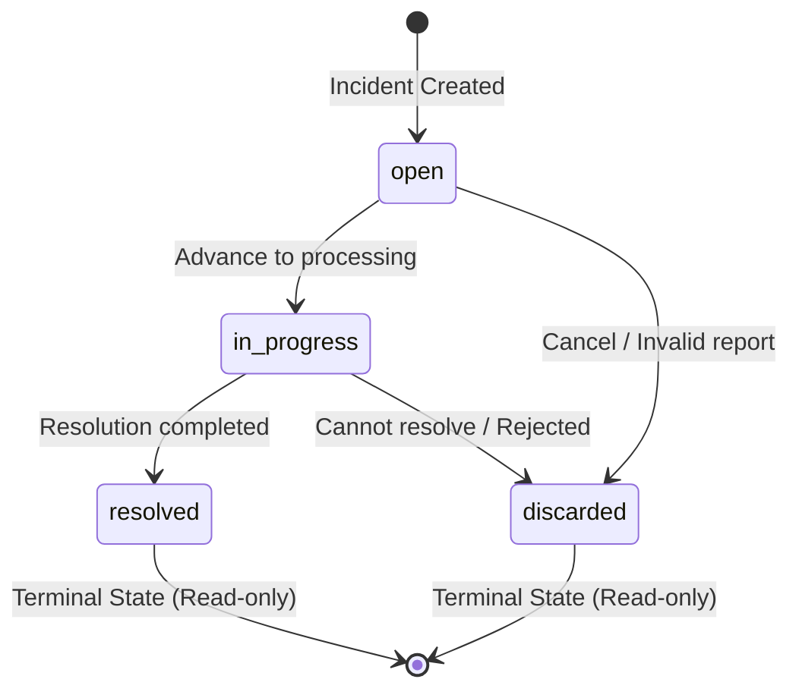

# Data Model & State Machine Specification: Centralized Incident Manager - Backend

## 1. Incident Status Lifecycle State Machine



### Transition Validation Table

| Current Status | Proposed Status | Valid? | HTTP Code | Error Message |
| :--- | :--- | :---: | :---: | :--- |
| `open` | `in_progress` | Yes | 200 | OK |
| `open` | `discarded` | Yes | 200 | OK |
| `open` | `resolved` | No | 400 | Invalid transition: Cannot transition directly from 'open' to 'resolved'. |
| `in_progress` | `resolved` | Yes | 200 | OK |
| `in_progress` | `discarded` | Yes | 200 | OK |
| `in_progress` | `open` | No | 400 | Invalid transition: Cannot regress from 'in_progress' to 'open'. |
| `resolved` | *any* | No | 400 | Invalid transition: Incident is in terminal state 'resolved' and cannot be modified. |
| `discarded` | *any* | No | 400 | Invalid transition: Incident is in terminal state 'discarded' and cannot be modified. |

---

## 2. DTO Specifications

### IncidentStatusUpdateSchema (PATCH `/api/incidents/{id}/status`)

```json
{
  "status": "in_progress"
}
```

### SummaryMetricsResponseSchema (GET `/api/incidents/summary`)

```json
{
  "total_incidents": 10,
  "by_status": {
    "open": 3,
    "in_progress": 2,
    "resolved": 4,
    "discarded": 1
  },
  "by_category": {
    "warehouse": 3,
    "reverse_logistics": 2,
    "last_mile": 3,
    "customer_experience": 2
  },
  "by_origin": {
    "customer": 7,
    "branch": 2,
    "internal": 1
  },
  "by_branch": {
    "central": 7,
    "los_angeles": 2,
    "zaragoza": 1
  }
}
```
