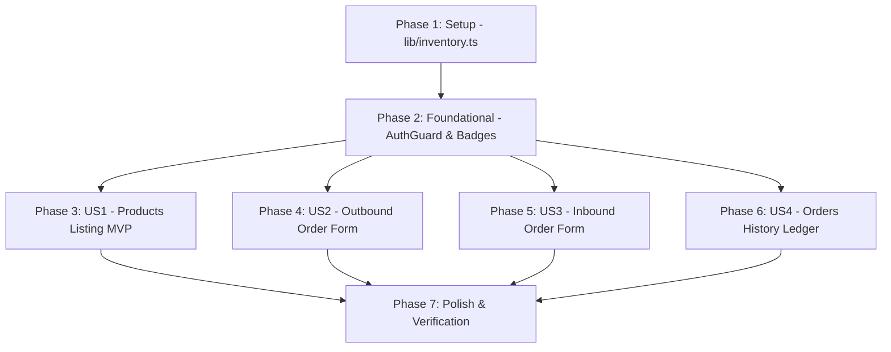

# Tasks: Backoffice Inventory Management Interface

**Input**: Design documents from `/specs/011-backoffice-inventory-ui/`
**Prerequisites**: [plan.md](file:///j:/GitHub/mr-stegmann-ai-engineering-company-project-monorepo/specs/011-backoffice-inventory-ui/plan.md), [spec.md](file:///j:/GitHub/mr-stegmann-ai-engineering-company-project-monorepo/specs/011-backoffice-inventory-ui/spec.md), [research.md](file:///j:/GitHub/mr-stegmann-ai-engineering-company-project-monorepo/specs/011-backoffice-inventory-ui/research.md), [data-model.md](file:///j:/GitHub/mr-stegmann-ai-engineering-company-project-monorepo/specs/011-backoffice-inventory-ui/data-model.md), [contracts/inventory-api-contract.md](file:///j:/GitHub/mr-stegmann-ai-engineering-company-project-monorepo/specs/011-backoffice-inventory-ui/contracts/inventory-api-contract.md)

---

## Format: `[ID] [P?] [Story?] Description with file path`

- **[P]**: Task can run in parallel (operates on distinct files with no blocking dependencies).
- **[Story]**: User story identifier ([US1], [US2], [US3], [US4]) from `spec.md`.

---

## Phase 1: Setup (Shared Infrastructure & API Integration Module)

**Purpose**: Establish centralized API client layer and interface definitions for all `/inventory` operations.

- [x] T001 Define TypeScript interfaces (`InventoryProduct`, `InboundOrderPayload`, `OutboundOrderPayload`, `InventoryOrderRecord`) in `uis/backoffice/lib/inventory.ts`
- [x] T002 Implement centralized API client functions (`getInventoryProducts`, `getInventoryProductById`, `createInboundOrder`, `createOutboundOrder`, `getInventoryOrders`) using `fetchWithAuth` in `uis/backoffice/lib/inventory.ts`
- [x] T003 [P] Update navigation header links in `uis/backoffice/components/Header.tsx` to include inventory routes (`/inventory/products`, `/inventory/orders/inbound`, `/inventory/orders/outbound`, `/inventory/orders`)

---

## Phase 2: Foundational (Blocking Prerequisites)

**Purpose**: Core UI components and route authentication prerequisites required by all inventory views.

- [x] T004 Verify and update route protection rules in `uis/backoffice/components/AuthGuard.tsx` to enforce authentication for all `/inventory/**` paths
- [x] T005 [P] Create visual stock status badge component (`StockStatusBadge`) in `uis/backoffice/components/inventory/StockStatusBadge.tsx` displaying healthy (green), low stock (amber), and out of stock (red) status badges

**Checkpoint**: Foundation ready — user story implementation can begin in parallel.

---

## Phase 3: User Story 1 - Live Product Inventory & Stock Level Indicators (Priority: P1) 🎯 MVP

**Goal**: Operations staff can view all products from `GET /inventory/products` with SKU, warehouse origin (`wh-la`, `wh-zgz`), `current_stock`, visual health indicators, and direct order action links.

**Independent Test**: Navigate to `/inventory/products` as an authenticated user, verify live products render with correct stock status badges and quick order action buttons.

- [x] T006 [P] [US1] Create product table component (`ProductTable`) in `uis/backoffice/components/inventory/ProductTable.tsx` displaying product rows, stock badges, and direct action links to inbound/outbound forms
- [x] T007 [US1] Implement products page view in `uis/backoffice/app/inventory/products/page.tsx` fetching data via `getInventoryProducts` with loading spinner and error alert fallback

**Checkpoint**: User Story 1 (MVP) is fully functional and testable independently.

---

## Phase 4: User Story 2 - Reactive Outbound Order Logging & Stock Guard (Priority: P2)

**Goal**: Warehouse workers can log stock exits with reactive available stock display, client-side quantity warning guard, and inline API `400` error rendering.

**Independent Test**: Select a product in `/inventory/orders/outbound`, verify available stock displays reactively, enter a quantity exceeding stock to view the warning banner, and submit to verify inline 400 error rendering.

- [x] T008 [P] [US2] Create outbound order form component (`OutboundOrderForm`) in `uis/backoffice/components/inventory/OutboundOrderForm.tsx` with reactive stock lookup, client-side stock warning, and inline quantity error rendering
- [x] T009 [US2] Implement outbound order form page in `uis/backoffice/app/inventory/orders/outbound/page.tsx` submitting via `createOutboundOrder` and handling pre-selected product query parameter (`?sku_id=...`)

**Checkpoint**: User Stories 1 and 2 work independently.

---

## Phase 5: User Story 3 - Inbound Delivery Order Logging (Priority: P3)

**Goal**: Receiving clerks can log inbound supplier deliveries selecting products by human-readable name, receive confirmation feedback, and reset form inputs.

**Independent Test**: Submit a valid inbound order at `/inventory/orders/inbound`, verify success notification and form field reset, and confirm product stock increases on `/inventory/products`.

- [x] T010 [P] [US3] Create inbound order form component (`InboundOrderForm`) in `uis/backoffice/components/inventory/InboundOrderForm.tsx` with human-readable product selection, form reset on success, and visible error alerts
- [x] T011 [US3] Implement inbound order form page in `uis/backoffice/app/inventory/orders/inbound/page.tsx` submitting via `createInboundOrder` and handling pre-selected product query parameter (`?sku_id=...`)

**Checkpoint**: User Stories 1, 2, and 3 work independently.

---

## Phase 6: User Story 4 - Audit-Ready Orders History Ledger (Priority: P4)

**Goal**: Operations managers can inspect a read-only historical ledger of all inbound and outbound stock transactions from `GET /inventory/orders`.

**Independent Test**: Navigate to `/inventory/orders`, verify table renders historical orders with color-coded order type badges (`inbound` vs `outbound`), quantity, creation date, and `user_uuid`.

- [x] T012 [P] [US4] Create orders history table component (`OrdersHistoryTable`) in `uis/backoffice/components/inventory/OrdersHistoryTable.tsx` displaying order type badges, product code, quantity, creation timestamp, and `user_uuid`
- [x] T013 [US4] Implement orders history page view in `uis/backoffice/app/inventory/orders/page.tsx` fetching data via `getInventoryOrders` with error alert handling

**Checkpoint**: All 4 user stories are independently functional.

---

## Phase 7: Polish & Cross-Cutting Concerns

**Purpose**: Quality assurance, automated testing, and build integrity verification.

- [x] T014 [P] Add unit and component integration tests for inventory client and views in `uis/backoffice/__tests__/inventory.test.ts`
- [x] T015 Verify TypeScript build integrity and zero compiler errors with `npm run build` in `uis/backoffice`
- [x] T016 Perform end-to-end verification against `quickstart.md` scenarios across all 4 inventory pages

---

## Dependencies & Execution Order

### Phase Dependencies

### Parallel Execution Opportunities

- **Phase 1**: `T003` (Header update) can run in parallel with `T001`/`T002`.
- **Phase 2**: `T005` (`StockStatusBadge`) can be built in parallel with `T004`.
- **Phase 3-6 (User Stories)**: Once Phase 2 completes, US1 (`T006`/`T007`), US2 (`T008`/`T009`), US3 (`T010`/`T011`), and US4 (`T012`/`T013`) can be developed in parallel as their UI components reside in separate files.

---

## Implementation Strategy: MVP First

1. **Step 1**: Complete Setup (`T001` - `T003`) and Foundational (`T004` - `T005`).
2. **Step 2**: Complete User Story 1 (`T006` - `T007`) → Validate live product stock listing MVP.
3. **Step 3**: Complete User Story 2 (`T008` - `T009`) → Validate reactive outbound stock guard.
4. **Step 4**: Complete User Story 3 (`T010` - `T011`) → Validate inbound order form.
5. **Step 5**: Complete User Story 4 (`T012` - `T013`) → Validate read-only orders ledger.
6. **Step 6**: Complete Polish (`T014` - `T016`) → Run full build and quickstart verification.
