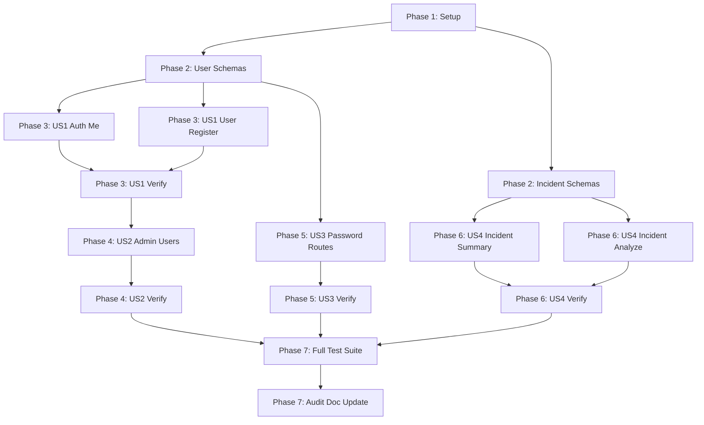

# Tasks: Backend Serialization Improvement

**Input**: Design documents from `specs/013-backend-serialization-improvement/`
**Prerequisites**: [plan.md](plan.md), [spec.md](spec.md), [research.md](research.md), [data-model.md](data-model.md), [contracts/api-contracts.md](contracts/api-contracts.md)

---

## Phase 1: Setup (Shared Infrastructure)

**Purpose**: Baseline verification of services and testing environment

- [X] T001 Initialize workspace environment and verify baseline pytest suite in `services/api/`

---

## Phase 2: Foundational (Blocking Prerequisites)

**Purpose**: Define all shared Pydantic DTO models required by user story route handlers

**⚠️ CRITICAL**: Must be completed before route decorator updates in user story phases

- [X] T002 [P] Define `UserResponse` and `MessageResponse` Pydantic schemas in `services/api/domain/models.py`
- [X] T003 [P] Define `IncidentSummaryResponse`, `IncidentMetrics`, `InvalidRecordDetail`, `IncidentDiagnostics`, and `IncidentAnalysisResponse` schemas in `services/api/domain/schemas/incident_schema.py`

**Checkpoint**: Core DTO schemas available and importable. User story implementations can proceed.

---

## Phase 3: User Story 1 - Secure User Registration & Self-Inspection (Priority: P1) 🎯 MVP

**Goal**: Eliminate `hashed_password` credential leakage on user registration (`POST /users`) and authenticated self-inspection (`GET /auth/me`).

**Independent Test**: Register a user and query `/auth/me` with Bearer token; confirm output contains `id`, `email`, `role`, and `is_active` without `hashed_password`.

- [X] T004 [US1] Update `GET /auth/me` route in `services/api/presentation/api/auth_routes.py` to use `response_model=UserResponse`
- [X] T005 [US1] Update `POST /users` registration route in `services/api/presentation/api/user_routes.py` to use `response_model=UserResponse`
- [X] T006 [US1] Verify user registration and `GET /auth/me` serialization via `services/api/tests/api/test_user_registration_api.py` and `services/api/tests/api/test_me_api.py`

**Checkpoint**: User Story 1 functional and independently testable without credential leakage.

---

## Phase 4: User Story 2 - Administrative User Directory Inspection without Credential Exposure (Priority: P2)

**Goal**: Secure admin user listing, retrieval, and update endpoints against password hash exposure.

**Independent Test**: Issue admin requests to `GET /users`, `GET /users/{id}`, and `PUT /users/{id}`; verify returned payloads contain no `hashed_password` field.

- [X] T007 [US2] Update `GET /users`, `GET /users/{user_id}`, and `PUT /users/{user_id}` route decorators in `services/api/presentation/api/user_routes.py` to use `response_model=List[UserResponse]` and `response_model=UserResponse`
- [X] T008 [US2] Verify administrative user CRUD endpoints via `services/api/tests/api/test_users.py`

**Checkpoint**: User Stories 1 and 2 operate securely without exposing password hashes.

---

## Phase 5: User Story 3 - Structured Password Recovery & Operational Messages (Priority: P3)

**Goal**: Add explicit `MessageResponse` schemas to unauthenticated password recovery and authenticated password change handlers.

**Independent Test**: Execute `/auth/forgot-password`, `/auth/reset-password`, and `/auth/change-password`; confirm response payloads match `{"message": str}` without echoing email or token data.

- [X] T009 [US3] Update `POST /auth/forgot-password`, `POST /auth/reset-password`, and `POST /auth/change-password` routes in `services/api/presentation/api/auth_routes.py` to declare `response_model=MessageResponse`
- [X] T010 [US3] Verify password reset and change operations via `services/api/tests/api/test_password_reset_api.py` and `services/api/tests/api/test_change_password_api.py`

**Checkpoint**: Password recovery and change handlers enforce structured message responses.

---

## Phase 6: User Story 4 - Strict Incident Analytics & Aggregation Schemas (Priority: P4)

**Goal**: Replace loose `Dict[str, Any]` and untyped dictionaries with concrete models for incident summary and CSV stream analysis.

**Independent Test**: Query `GET /api/incidents/summary` and upload CSV to `POST /api/incidents/analyze`; confirm JSON payloads match `IncidentSummaryResponse` and `IncidentAnalysisResponse`.

- [X] T011 [US4] Update `GET /api/incidents/summary` in `services/api/presentation/api/incident_routes.py` to use `response_model=IncidentSummaryResponse`
- [X] T012 [US4] Update `POST /api/incidents/analyze` in `services/api/main.py` to use `response_model=IncidentAnalysisResponse`
- [X] T013 [US4] Verify incident summary and CSV analysis endpoints via `services/api/tests/test_incident_summary_api.py` and `services/api/tests/test_incident_creation_api.py`

**Checkpoint**: All analytics and ingestion routes enforce concrete response schemas.

---

## Phase 7: Polish & Documentation

**Purpose**: Full regression suite validation and audit documentation update

- [X] T014 Execute full automated regression test suite across `services/api/tests/`
- [X] T015 [P] Update serialization audit document in `docs/serialization-audit.md` and `backend-audit.md` to reflect 100% compliant status (all 31 endpoints marked ✅)

---

## Dependencies & Execution Order

---

## Implementation Strategy

### MVP Scope (User Story 1)
- Complete Phase 1 (Setup) and Phase 2 (Foundational Schemas).
- Implement User Story 1 (`T004` to `T006`) to resolve the critical password hash leakage in `/auth/me` and `/users` registration.
- Validate independently before proceeding to administrative and analytics endpoints.

### Incremental Delivery Order
1. **Foundation**: Create schemas in `models.py` and `incident_schema.py`.
2. **US1 (P1)**: User Registration & Self-Inspection (`auth_routes.py`, `user_routes.py`).
3. **US2 (P2)**: Admin User CRUD (`user_routes.py`).
4. **US3 (P3)**: Password Recovery & Operational Messages (`auth_routes.py`).
5. **US4 (P4)**: Incident Aggregations & CSV Stream Analysis (`incident_routes.py`, `main.py`).
6. **Polish**: Full regression suite & audit documentation update.
