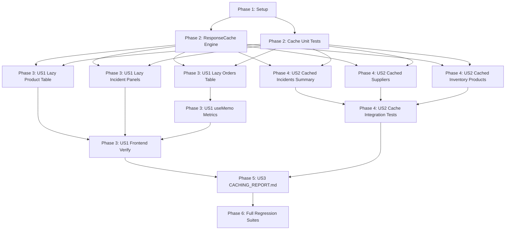

# Tasks: Caching & Lazy Loading Optimization

**Input**: Design documents from `specs/014-caching-optimization/`
**Prerequisites**: [plan.md](plan.md), [spec.md](spec.md), [research.md](research.md), [data-model.md](data-model.md), [contracts/api-contracts.md](contracts/api-contracts.md)

---

## Phase 1: Setup (Shared Infrastructure)

**Purpose**: Baseline verification of backend and frontend environments

- [X] T001 Verify backend pytest test suite in `services/api/` and frontend test/build suite in `uis/backoffice/`

---

## Phase 2: Foundational (Blocking Prerequisites)

**Purpose**: In-memory TTL caching engine and core unit test harness

**⚠️ CRITICAL**: Must be completed before caching is wired into route handlers

- [X] T002 [P] Implement `ResponseCache` in-memory TTL caching utility with prefix invalidation in `services/api/infrastructure/cache.py`
- [X] T003 [P] Implement unit tests for `ResponseCache` (testing TTL expiration, cache hit/miss, key invalidation, prefix invalidation) in `services/api/tests/unit/test_cache.py`

**Checkpoint**: Core cache module and unit tests passing. Route integration can proceed.

---

## Phase 3: User Story 1 - Client-Side Dynamic Loading & Rendering Optimization (Priority: P1) 🎯 MVP

**Goal**: Implement dynamic/lazy loading for heavy data tables and panels across `uis/backoffice`, and apply `useMemo` to non-trivial derived metrics calculations.

**Independent Test**: Load `/inventory/orders`, `/inventory/products`, and `/incidents` in `uis/backoffice`; confirm components load asynchronously with proper fallbacks, and verify `OrdersHistoryTable` calculates volume metrics efficiently without recalculating on unrelated re-renders.

- [X] T004 [P] [US1] Implement dynamic lazy loading with skeleton placeholder for `OrdersHistoryTable` in `uis/backoffice/app/inventory/orders/page.tsx`
- [X] T005 [P] [US1] Implement dynamic lazy loading with skeleton placeholder for `ProductTable` in `uis/backoffice/app/inventory/products/page.tsx`
- [X] T006 [P] [US1] Implement dynamic lazy loading with loading fallbacks for `IncidentSummaryPanel` and `IncidentListPanel` in `uis/backoffice/app/incidents/page.tsx`
- [X] T007 [US1] Implement `useMemo` optimization for composite order volume metrics calculation in `uis/backoffice/components/inventory/OrdersHistoryTable.tsx`
- [X] T008 [US1] Verify frontend build and tests via `npm test` and `npm run build` in `uis/backoffice/`

**Checkpoint**: User Story 1 complete: frontend bundle optimized with lazy-loaded components and memoized metrics.

---

## Phase 4: User Story 2 - High-Efficiency Server-Side Query Caching & Fast Invalidation (Priority: P2)

**Goal**: Apply TTL-based response caching to high-cost stable endpoints (`/api/incidents/summary`, `/suppliers`, `/inventory/products`) and implement write-through cache invalidation on mutations.

**Independent Test**: Query cached endpoints consecutively to confirm sub-millisecond responses on cache hits; perform a data mutation (e.g., incident create, supplier rate patch, inbound order registration) and confirm the cache is immediately purged.

- [X] T009 [P] [US2] Integrate TTL caching (30s) and mutation invalidation (`incident_summary:`) into `services/api/presentation/api/incident_routes.py` and `services/api/main.py`
- [X] T010 [P] [US2] Integrate TTL caching (60s) and mutation invalidation (`suppliers:`) into `services/api/routes/suppliers.py`
- [X] T011 [P] [US2] Integrate TTL caching (30s) and mutation invalidation (`inventory_products:`) into `services/api/main.py`
- [X] T012 [US2] Implement integration tests verifying cache hits, TTL expiration, parameter isolation, and mutation invalidation in `services/api/tests/api/test_cached_endpoints.py`

**Checkpoint**: User Story 2 complete: backend endpoints cached with TTL and immediate mutation invalidation.

---

## Phase 5: User Story 3 - Comprehensive Caching Decision Audit & Technical Report (Priority: P3)

**Goal**: Document all frontend and backend decisions, evaluation matrices, tradeoffs, and exclusions in `CACHING_REPORT.md`.

**Independent Test**: Inspect `CACHING_REPORT.md`; verify all sections (Frontend Decisions, Backend Decisions, Freshness vs Performance Tradeoffs, What Was Not Cached and Why) are comprehensive and specific.

- [X] T013 [US3] Author `CACHING_REPORT.md` in repository root covering all required frontend/backend decisions, matrices, tradeoffs, and exclusions

**Checkpoint**: User Story 3 complete: technical report finalized.

---

## Phase 6: Polish & Cross-Cutting Verification

**Purpose**: Execute full regression test suites across the monorepo

- [X] T014 Execute full automated test suites across backend (`services/api/`) and frontend (`uis/backoffice/`) to ensure 100% test pass rate with zero regressions

---

## Dependencies & Execution Order

---

## Implementation Strategy

### MVP Scope (User Story 1)
- Complete Phase 1 (Setup) and Phase 2 (Foundational Cache Engine).
- Complete Phase 3 (Frontend Lazy Loading & `useMemo` Optimization).
- Validate frontend independently before applying backend endpoint caching.

### Incremental Delivery Order
1. **Foundation**: Build in-memory TTL caching engine and unit test harness.
2. **US1 (P1)**: Frontend Lazy Loading (`OrdersHistoryTable`, `ProductTable`, `IncidentSummaryPanel`) & `useMemo`.
3. **US2 (P2)**: Backend Endpoint Caching (`/api/incidents/summary`, `/suppliers`, `/inventory/products`) & Invalidation.
4. **US3 (P3)**: Technical Report (`CACHING_REPORT.md`).
5. **Polish**: Full regression testing.
