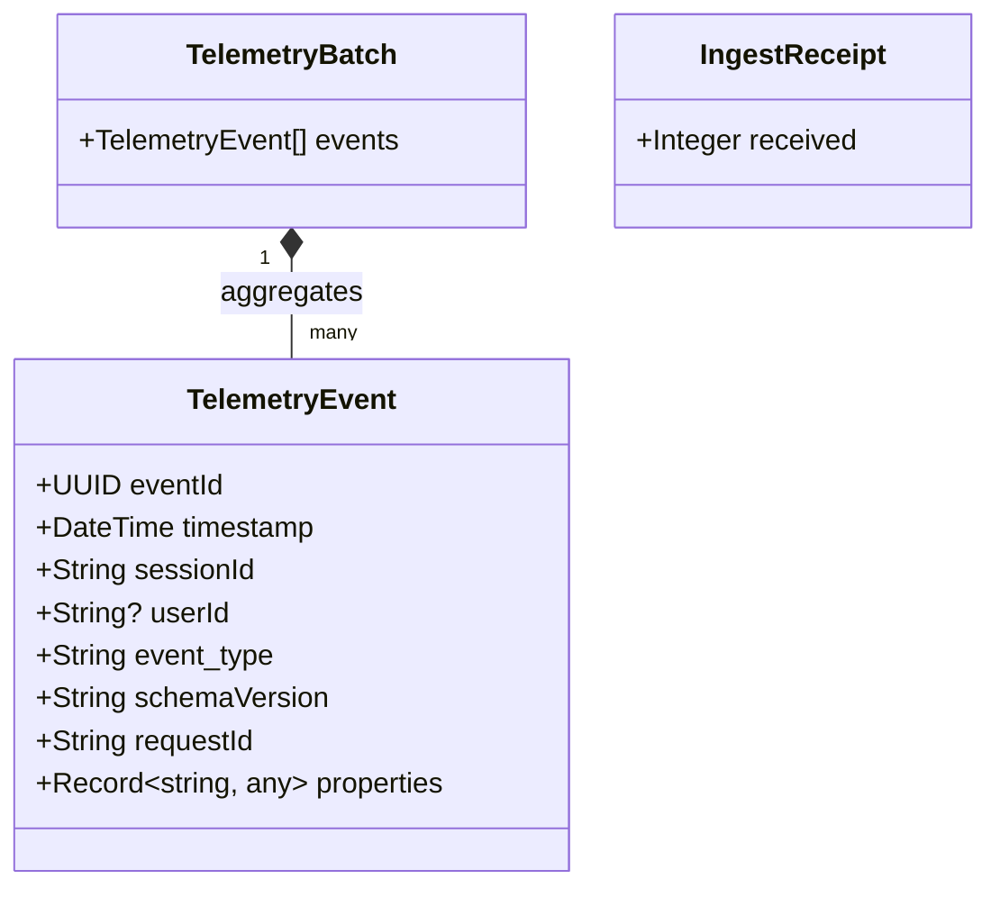
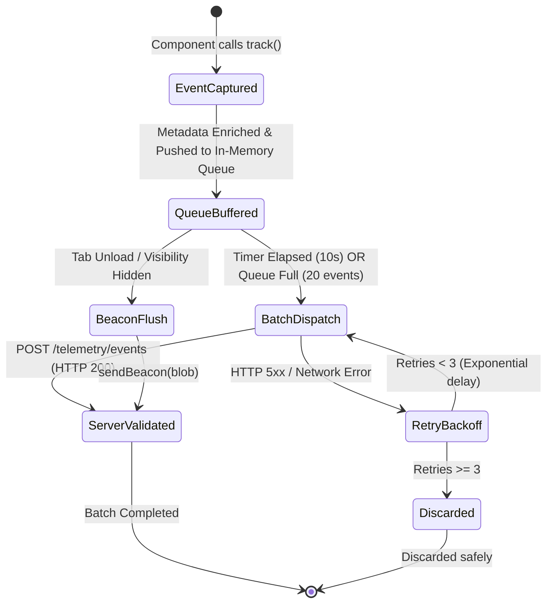

# Phase 1: Data Model Specification

**Feature**: Telemetry Event Capture  
**Feature Branch**: `015-telemetry-event-capture`  
**Date**: 2026-10-06  
**Status**: Completed  

---

## 1. Entities & Structural Definitions

### 1.1 Universal Event Envelope (`TelemetryEvent`)
Represents the standard outer metadata wrapper encapsulating every telemetry interaction emitted by client applications and services.

| Field Name | Type | Required | Description | Validation Rules |
| :--- | :--- | :--- | :--- | :--- |
| `eventId` | `UUID` (string) | Yes | Globally unique UUIDv4 identifying this event instance. | Valid UUIDv4 format (`crypto.randomUUID()`). |
| `timestamp` | `ISO 8601 UTC string` | Yes | High-precision timestamp when the event occurred. | RFC 3339 / ISO 8601 date-time (e.g. `2026-10-06T10:30:00.000Z`). |
| `sessionId` | `String` | Yes | Unique session identifier spanning continuous user activity. | Non-empty string; persistent within browser session storage. |
| `userId` | `String` or `null` | No | Pseudonymized identifier of authenticated user/operator. | Nullable string; null if unauthenticated. |
| `event_type` | `String` | Yes | Taxonomy name conforming to `entity_action` format. | Regex: `^[a-z0-9]+(_[a-z0-9]+)+$` |
| `schemaVersion` | `String` | Yes | Semantic version of the payload contract. | Regex: `^[0-9]+\.[0-9]+\.[0-9]+$` (default: `"1.0.0"`). |
| `requestId` | `String` | Yes | Distributed tracing correlation identifier. | Non-empty string / UUID. |
| `properties` | `Object` / `Dict` | Yes | Domain-specific event payload conforming to allowlist. | Non-null object. Zero PII fields allowed. |

---

### 1.2 Telemetry Batch Entity (`TelemetryBatch`)
Represents the transport container containing multiple accumulated `TelemetryEvent` records.

| Field Name | Type | Required | Description | Validation Rules |
| :--- | :--- | :--- | :--- | :--- |
| `events` | `List[TelemetryEvent]` | Yes | Array of enveloped telemetry events. | Array length: `1 <= count <= 100`. |

---

### 1.3 Ingestion Receipt Entity (`IngestReceipt`)
The HTTP 200 acknowledgment returned by the ingestion gateway.

| Field Name | Type | Required | Description | Validation Rules |
| :--- | :--- | :--- | :--- | :--- |
| `received` | `Integer` | Yes | Total number of valid events processed in the batch. | `received >= 0`. Must equal `len(events)`. |

---

## 2. Domain Payload Allowlist Models (`properties`)

### 2.1 Technical Baseline Schemas

#### `frontend_error_captured`
- `errorName`: `string` (e.g., `"TypeError"`, `"UnhandledPromiseRejection"`)
- `errorMessage`: `string` (sanitized exception message)
- `stackTraceSnippet`: `string` (truncated stack trace, max 1000 chars)
- `url`: `string` (current window location path)
- `componentName`: `string` (optional React component name)

#### `api_latency_recorded`
- `endpointPath`: `string` (sanitized route, e.g., `"/api/v1/inventory"`)
- `httpMethod`: `string` (`"GET" | "POST" | "PUT" | "DELETE" | "PATCH"`)
- `durationMs`: `number` (elapsed milliseconds)
- `httpStatusCode`: `number` (HTTP response status)
- `success`: `boolean` (true if status < 400)

#### `section_navigation_tracked`
- `sourceSection`: `string` (previous route / section)
- `destinationSection`: `string` (new route / section)
- `navigationDurationMs`: `number` (transition time in milliseconds)

---

### 2.2 Operational / Inventory Business Schemas

#### `inbound_order_created`
- `inboundOrderId`: `string`
- `clientId`: `string`
- `warehouseCode`: `string` (`"LA-01" | "ZAZ-01"`)
- `totalSkus`: `integer` (`>= 1`)
- `totalUnits`: `integer` (`>= 1`)
- `sourceChannel`: `string` (`"EDI" | "PORTAL" | "EMAIL_PARSER" | "MANUAL"`)

#### `stock_threshold_triggered`
- `skuId`: `string`
- `warehouseCode`: `string`
- `currentAvailableQuantity`: `integer`
- `safetyThresholdQuantity`: `integer`
- `triggerSeverity`: `string` (`"WARNING" | "CRITICAL"`)

#### `direct_stock_edit_rejected`
- `attemptedByUserId`: `string`
- `warehouseCode`: `string`
- `skuId`: `string`
- `attemptedDelta`: `integer`
- `rejectionReason`: `string`

#### `stock_validation_failed`
- `orderId`: `string`
- `warehouseCode`: `string`
- `skuId`: `string`
- `expectedQuantity`: `integer`
- `actualQuantity`: `integer`
- `failureReason`: `string`

#### `outbound_order_fulfilled`
- `orderId`: `string`
- `clientId`: `string`
- `warehouseCode`: `string`
- `carrierCode`: `string` (`"UPS" | "FEDEX" | "DHL" | "MRW" | "SEUR"`)
- `fulfillmentDurationSeconds`: `number`
- `totalItems`: `integer`

---

## 3. State Lifecycle & Queue Transitions

