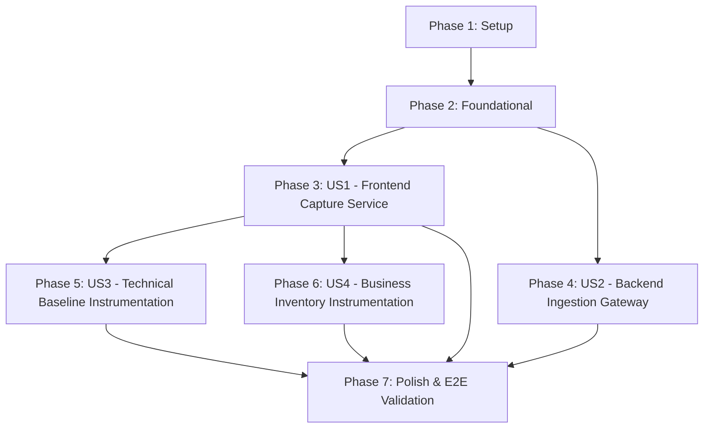

# Tasks: Telemetry Event Capture

**Input**: Design documents from `specs/015-telemetry-event-capture/`  
**Prerequisites**: [plan.md](file:///j:/GitHub/mr-stegmann-ai-engineering-company-project-monorepo/specs/015-telemetry-event-capture/plan.md), [spec.md](file:///j:/GitHub/mr-stegmann-ai-engineering-company-project-monorepo/specs/015-telemetry-event-capture/spec.md), [research.md](file:///j:/GitHub/mr-stegmann-ai-engineering-company-project-monorepo/specs/015-telemetry-event-capture/research.md), [data-model.md](file:///j:/GitHub/mr-stegmann-ai-engineering-company-project-monorepo/specs/015-telemetry-event-capture/data-model.md), [contracts/](file:///j:/GitHub/mr-stegmann-ai-engineering-company-project-monorepo/specs/015-telemetry-event-capture/contracts/telemetry-api.yaml)  

## Format: `[ID] [P?] [Story] Description with file path`

- **[P]**: Can run in parallel (different files, no dependencies)
- **[Story]**: Which user story this task belongs to (e.g., [US1], [US2], [US3], [US4])
- Strict adherence to checklist format with exact file paths

---

## Phase 1: Setup (Shared Infrastructure)

**Purpose**: Environment configuration and shared telemetry types setup

- [ ] T001 [P] Configure environment variables `NEXT_PUBLIC_TELEMETRY_ENDPOINT` in `uis/backoffice/.env.local` and `TELEMETRY_ENDPOINT` in `services/api/.env`
- [ ] T002 [P] Create telemetry schemas, standard envelope types, and allowlist payload definitions in `uis/backoffice/app/services/telemetry-types.ts`

---

## Phase 2: Foundational (Blocking Prerequisites)

**Purpose**: Core backend Pydantic models and router registration blocking ingestion

- [ ] T003 Define Pydantic `TelemetryEvent` and `TelemetryBatch` envelope models with strict regex and validation rules in `services/api/routers/telemetry.py`
- [ ] T004 Register telemetry router in `services/api/main.py` and mount `POST /telemetry/events`

**Checkpoint**: Foundation ready - user stories can now be implemented independently.

---

## Phase 3: User Story 1 - Resilient Client-Side Event Capture & Batch Delivery (Priority: P1) 🎯 MVP

**Goal**: Implement client-side `TelemetryService` in the backoffice with local queue buffering, 10s / 20-event debounce batching, tab-exit `sendBeacon` flush, exponential backoff retries, and automatic envelope enrichment.

**Independent Test**: Trigger multiple `track()` calls in the frontend, verify events accumulate in memory without immediate network calls, flush automatically upon reaching 20 events or 10 seconds, flush on tab visibility change to hidden, and retry on failure with backoff.

### Tests for User Story 1
- [ ] T005 [P] [US1] Create frontend unit test suite for TelemetryService queue, batching, `sendBeacon`, and exponential retry backoff in `uis/backoffice/__tests__/services/telemetry.test.ts`

### Implementation for User Story 1
- [ ] T006 [US1] Implement in-memory queue, batching timer (10s), and batch threshold (20 events) in `uis/backoffice/app/services/telemetry.ts`
- [ ] T007 [US1] Implement automatic envelope enrichment (`eventId`, `sessionId`, `userId`, `timestamp`, `schemaVersion`, `requestId`) and single public `track()` function in `uis/backoffice/app/services/telemetry.ts`
- [ ] T008 [US1] Implement `visibilitychange` and unload lifecycle listener with `navigator.sendBeacon` and keepalive fetch fallback in `uis/backoffice/app/services/telemetry.ts`
- [ ] T009 [US1] Implement exponential backoff retry handler (up to 3 attempts with 1s, 2s, 4s delay) in `uis/backoffice/app/services/telemetry.ts`

**Checkpoint**: User Story 1 is fully functional and testable independently.

---

## Phase 4: User Story 2 - Backend Telemetry Ingestion & Contract Validation (Priority: P1)

**Goal**: Provide FastAPI endpoint `POST /telemetry/events` validating incoming batch payloads, logging received count and event types, and returning HTTP 200 `{ "received": N }`.

**Independent Test**: Post valid and invalid batch payloads via curl/pytest, verify schema validation, log entries, and response codes (200 for valid batches, 422 for invalid envelopes).

### Tests for User Story 2
- [ ] T010 [P] [US2] Create backend pytest suite verifying schema validation, 200 OK receipt response, and 422 error cases in `services/api/tests/api/test_telemetry.py`

### Implementation for User Story 2
- [ ] T011 [US2] Implement `POST /telemetry/events` endpoint handler, logging event counts and `event_type` of each item in `services/api/routers/telemetry.py`
- [ ] T012 [US2] Wire `TELEMETRY_ENDPOINT` configuration lookup and route registration in `services/api/routers/telemetry.py`

**Checkpoint**: User Stories 1 and 2 are complete, establishing full end-to-end telemetry transport.

---

## Phase 5: User Story 3 - Cross-Cutting Technical Telemetry Baseline (Priority: P2)

**Goal**: Automatically capture uncaught frontend exceptions (`frontend_error_captured`), API call latencies (`api_latency_recorded`), and section navigation (`section_navigation_tracked`) across the backoffice.

**Independent Test**: Trigger an unhandled error, perform page navigation, and execute an API call in the backoffice UI, verifying corresponding telemetry events are captured with allowlisted properties.

### Tests for User Story 3
- [ ] T013 [P] [US3] Create test suite for technical telemetry capture (errors, API latency, navigation) in `uis/backoffice/__tests__/services/technical-telemetry.test.ts`

### Implementation for User Story 3
- [ ] T014 [P] [US3] Create `TelemetryProvider` component with global error boundaries and `window.onerror` / `unhandledrejection` handlers emitting `frontend_error_captured` in `uis/backoffice/app/components/TelemetryProvider.tsx`
- [ ] T015 [US3] Mount `TelemetryProvider` and instrument route change navigation tracker emitting `section_navigation_tracked` in `uis/backoffice/app/layout.tsx`
- [ ] T016 [US3] Instrument central API client / fetch wrapper to record duration and emit `api_latency_recorded` in `uis/backoffice/lib/api.ts`

**Checkpoint**: Cross-cutting technical observability is active across the backoffice application.

---

## Phase 6: User Story 4 - Departmental Business & Operational Flow Instrumentation (Priority: P2)

**Goal**: Instrument core warehouse inventory workflows (`inbound_order_created`, `stock_threshold_triggered`, `direct_stock_edit_rejected`, `stock_validation_failed`, `outbound_order_fulfilled`) adhering strictly to `docs/telemetry/event-schemas.json` without PII.

**Independent Test**: Perform inventory actions (inbound receipt, stock adjustment, direct edit attempt, threshold alert), and verify emitted events contain exact allowlisted keys and zero PII.

### Tests for User Story 4
- [ ] T017 [P] [US4] Create test suite verifying inventory business event emission and zero-PII allowlist conformity in `uis/backoffice/__tests__/services/inventory-telemetry.test.ts`

### Implementation for User Story 4
- [ ] T018 [US4] Instrument inbound order creation (`inbound_order_created`) and direct stock edit rejection (`direct_stock_edit_rejected`) in `uis/backoffice/app/inventory/page.tsx`
- [ ] T019 [US4] Instrument low-stock threshold triggers (`stock_threshold_triggered`) and stock picking validation / fulfillment (`stock_validation_failed`, `outbound_order_fulfilled`) in `uis/backoffice/app/inventory/components/StockAdjustmentModal.tsx`

**Checkpoint**: All business operational flows are instrumented in full accordance with the approved plan.

---

## Phase 7: Polish & Cross-Cutting Concerns

**Purpose**: Final verification, PII audit, and end-to-end execution

- [ ] T020 [P] Validate zero-PII audit and property allowlist adherence across all telemetry calls in `uis/backoffice/app/`
- [ ] T021 Run complete quickstart validation scenarios and automated test verification per `specs/015-telemetry-event-capture/quickstart.md`

---

## Dependencies & Execution Order

### Phase Dependencies
- **Setup (Phase 1)**: Can start immediately.
- **Foundational (Phase 2)**: Depends on Phase 1 completion — blocks all user stories.
- **User Stories (Phases 3-6)**: Depend on Phase 2 completion.
  - US1 (Frontend Capture) & US2 (Backend Ingestion) form the P1 MVP backbone and can proceed in parallel.
  - US3 (Technical baseline) & US4 (Business instrumentation) depend on US1 (`track()` availability).
- **Polish (Phase 7)**: Depends on completion of all user story phases.

---

## Parallel Execution Opportunities

- **Parallel Setup**: `T001` (env vars) and `T002` (telemetry types) in parallel.
- **Parallel Tests**: `T005` (US1 test), `T010` (US2 test), `T013` (US3 test), and `T017` (US4 test) can be authored in parallel.
- **Parallel Instrumentation**: `T014` (`TelemetryProvider`) and `T016` (`api.ts` wrapper) can be implemented in parallel.

---

## Implementation Strategy (MVP First)

1. **MVP Scope**: Complete Phases 1, 2, 3 (US1), and 4 (US2).
2. **MVP Validation**: Run `quickstart.md` Scenario 1 & 2 to verify buffered transmission and 200 OK ingestion.
3. **Incremental Rollout**: Add Phase 5 (technical error/latency/nav baseline), then Phase 6 (inventory business events).
4. **Final Signoff**: Execute full test suites (`pytest` & `npm test`) and zero-PII audit.
